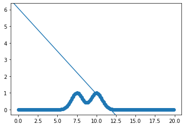
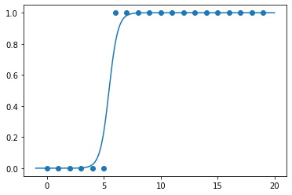

```python
import numpy as np
import matplotlib.pyplot as plt
from sklearn import datasets as ds
```


```python

```


```python
## LOCALLY WEIGHTED LINEAR REGRESSION 
```


```python

```


```python
x = np.arange(0,20,0.1);
dset = np.c_[x, np.exp(-(x-7.5)**2) + np.exp(-(x-10)**2)];
```


```python
fig, ax = plt.subplots()
ax.scatter(dset[:,0], dset[:,1])
ax.axline([0,6.07282451], slope = -0.51403871)
```


    <matplotlib.lines._AxLine at 0x7f21c0e9a2b0>


    

    


```python

```


```python
# BATCH GRADIENT DESCENT - (LOCALLY WEIGHTED) LINEAR REGRESSION. (if inFeaturesVector and tau are defined)

# Correction : In the literature what is named the design matrix is the matrix I named indep_v. 

def batchGradientDescent(designMatrix, alpha, nbrOfIteration, inFeaturesVector = None, tau = None):
    number_of_indep_v = designMatrix.shape[1] - 1;
    init_param = np.zeros(number_of_indep_v);
    
    alpha = alpha;
    tau = tau;
    
    indep_v = designMatrix[:,0:-1];
    dep_v = designMatrix[:,-1];
    
    dist = ( designMatrix[:,1:-1] - inFeaturesVector if inFeaturesVector else None );
    weighting = ( np.exp(-np.sum(dist**2, axis = 1)/(2*tau**2)) if tau else np.ones(designMatrix.shape[0]) )
    
    theta = init_param;
    for iteration in range(nbrOfIteration):
        
        theta_t = theta.copy();
        for j in range(len(theta)):
            theta[j] = theta_t[j] - alpha*( np.sum( weighting*(np.matmul(indep_v, theta_t) - dep_v)*designMatrix[:,j] ) )

            
    print(theta);
```


```python
batchGradientDescent(designMatrix, 0.0001, 1000000, 11, 0.5)
```

    [ 6.07282451 -0.51403871]


```python

```


```python
nbr_training_examples = dset.shape[0]
designMatrix = np.c_[np.ones(nbr_training_examples), dset]
designMatrix
```


    array([[1.00000000e+00, 0.00000000e+00, 3.72336312e-25],
           [1.00000000e+00, 1.00000000e-01, 1.65209178e-24],
           [1.00000000e+00, 2.00000000e-01, 7.18533564e-24],
           [1.00000000e+00, 3.00000000e-01, 3.06319086e-23],
           [1.00000000e+00, 4.00000000e-01, 1.28001532e-22],
           [1.00000000e+00, 5.00000000e-01, 5.24288566e-22],
           [1.00000000e+00, 6.00000000e-01, 2.10493998e-21],
           [1.00000000e+00, 7.00000000e-01, 8.28367701e-21],
           [1.00000000e+00, 8.00000000e-01, 3.19536672e-20],
           [1.00000000e+00, 9.00000000e-01, 1.20818202e-19],
           [1.00000000e+00, 1.00000000e+00, 4.47773244e-19],
           [1.00000000e+00, 1.10000000e+00, 1.62666462e-18],
           [1.00000000e+00, 1.20000000e+00, 5.79231289e-18],
           [1.00000000e+00, 1.30000000e+00, 2.02171585e-17],
           [1.00000000e+00, 1.40000000e+00, 6.91675398e-17],
           [1.00000000e+00, 1.50000000e+00, 2.31952283e-16],
           [1.00000000e+00, 1.60000000e+00, 7.62445991e-16],
           [1.00000000e+00, 1.70000000e+00, 2.45659537e-15],
           [1.00000000e+00, 1.80000000e+00, 7.75840208e-15],
           [1.00000000e+00, 1.90000000e+00, 2.40173478e-14],
           [1.00000000e+00, 2.00000000e+00, 7.28772410e-14],
           [1.00000000e+00, 2.10000000e+00, 2.16756888e-13],
           [1.00000000e+00, 2.20000000e+00, 6.31928589e-13],
           [1.00000000e+00, 2.30000000e+00, 1.80583144e-12],
           [1.00000000e+00, 2.40000000e+00, 5.05825274e-12],
           [1.00000000e+00, 2.50000000e+00, 1.38879439e-11],
           [1.00000000e+00, 2.60000000e+00, 3.73757133e-11],
           [1.00000000e+00, 2.70000000e+00, 9.85950558e-11],
           [1.00000000e+00, 2.80000000e+00, 2.54938188e-10],
           [1.00000000e+00, 2.90000000e+00, 6.46143177e-10],
           [1.00000000e+00, 3.00000000e+00, 1.60522806e-09],
           [1.00000000e+00, 3.10000000e+00, 3.90893843e-09],
           [1.00000000e+00, 3.20000000e+00, 9.33028757e-09],
           [1.00000000e+00, 3.30000000e+00, 2.18295780e-08],
           [1.00000000e+00, 3.40000000e+00, 5.00621802e-08],
           [1.00000000e+00, 3.50000000e+00, 1.12535175e-07],
           [1.00000000e+00, 3.60000000e+00, 2.47959602e-07],
           [1.00000000e+00, 3.70000000e+00, 5.35534780e-07],
           [1.00000000e+00, 3.80000000e+00, 1.13372714e-06],
           [1.00000000e+00, 3.90000000e+00, 2.35257520e-06],
           [1.00000000e+00, 4.00000000e+00, 4.78511739e-06],
           [1.00000000e+00, 4.10000000e+00, 9.54016287e-06],
           [1.00000000e+00, 4.20000000e+00, 1.86437423e-05],
           [1.00000000e+00, 4.30000000e+00, 3.57128496e-05],
           [1.00000000e+00, 4.40000000e+00, 6.70548243e-05],
           [1.00000000e+00, 4.50000000e+00, 1.23409804e-04],
           [1.00000000e+00, 4.60000000e+00, 2.22629857e-04],
           [1.00000000e+00, 4.70000000e+00, 3.93669041e-04],
           [1.00000000e+00, 4.80000000e+00, 6.82328055e-04],
           [1.00000000e+00, 4.90000000e+00, 1.15922918e-03],
           [1.00000000e+00, 5.00000000e+00, 1.93045415e-03],
           [1.00000000e+00, 5.10000000e+00, 3.15111164e-03],
           [1.00000000e+00, 5.20000000e+00, 5.04176036e-03],
           [1.00000000e+00, 5.30000000e+00, 7.90705431e-03],
           [1.00000000e+00, 5.40000000e+00, 1.21551790e-02],
           [1.00000000e+00, 5.50000000e+00, 1.83156405e-02],
           [1.00000000e+00, 5.60000000e+00, 2.70518508e-02],
           [1.00000000e+00, 5.70000000e+00, 3.91639044e-02],
           [1.00000000e+00, 5.80000000e+00, 5.55762344e-02],
           [1.00000000e+00, 5.90000000e+00, 7.73047905e-02],
           [1.00000000e+00, 6.00000000e+00, 1.05399337e-01],
           [1.00000000e+00, 6.10000000e+00, 1.40858669e-01],
           [1.00000000e+00, 6.20000000e+00, 1.84520060e-01],
           [1.00000000e+00, 6.30000000e+00, 2.36928892e-01],
           [1.00000000e+00, 6.40000000e+00, 2.98199632e-01],
           [1.00000000e+00, 6.50000000e+00, 3.67884226e-01],
           [1.00000000e+00, 6.60000000e+00, 4.44867606e-01],
           [1.00000000e+00, 6.70000000e+00, 5.27311068e-01],
           [1.00000000e+00, 6.80000000e+00, 6.12662107e-01],
           [1.00000000e+00, 6.90000000e+00, 6.97743381e-01],
           [1.00000000e+00, 7.00000000e+00, 7.78924193e-01],
           [1.00000000e+00, 7.10000000e+00, 8.52366419e-01],
           [1.00000000e+00, 7.20000000e+00, 9.14324854e-01],
           [1.00000000e+00, 7.30000000e+00, 9.61471767e-01],
           [1.00000000e+00, 7.40000000e+00, 9.91209063e-01],
           [1.00000000e+00, 7.50000000e+00, 1.00193045e+00],
           [1.00000000e+00, 7.60000000e+00, 9.93200945e-01],
           [1.00000000e+00, 7.70000000e+00, 9.65831199e-01],
           [1.00000000e+00, 7.80000000e+00, 9.21838239e-01],
           [1.00000000e+00, 7.90000000e+00, 8.64298967e-01],
           [1.00000000e+00, 8.00000000e+00, 7.97116422e-01],
           [1.00000000e+00, 8.10000000e+00, 7.24728173e-01],
           [1.00000000e+00, 8.20000000e+00, 6.51790289e-01],
           [1.00000000e+00, 8.30000000e+00, 5.82868637e-01],
           [1.00000000e+00, 8.40000000e+00, 5.22162807e-01],
           [1.00000000e+00, 8.50000000e+00, 4.73278666e-01],
           [1.00000000e+00, 8.60000000e+00, 4.39055700e-01],
           [1.00000000e+00, 8.70000000e+00, 4.21447283e-01],
           [1.00000000e+00, 8.80000000e+00, 4.21447283e-01],
           [1.00000000e+00, 8.90000000e+00, 4.39055700e-01],
           [1.00000000e+00, 9.00000000e+00, 4.73278666e-01],
           [1.00000000e+00, 9.10000000e+00, 5.22162807e-01],
           [1.00000000e+00, 9.20000000e+00, 5.82868637e-01],
           [1.00000000e+00, 9.30000000e+00, 6.51790289e-01],
           [1.00000000e+00, 9.40000000e+00, 7.24728173e-01],
           [1.00000000e+00, 9.50000000e+00, 7.97116422e-01],
           [1.00000000e+00, 9.60000000e+00, 8.64298967e-01],
           [1.00000000e+00, 9.70000000e+00, 9.21838239e-01],
           [1.00000000e+00, 9.80000000e+00, 9.65831199e-01],
           [1.00000000e+00, 9.90000000e+00, 9.93200945e-01],
           [1.00000000e+00, 1.00000000e+01, 1.00193045e+00],
           [1.00000000e+00, 1.01000000e+01, 9.91209063e-01],
           [1.00000000e+00, 1.02000000e+01, 9.61471767e-01],
           [1.00000000e+00, 1.03000000e+01, 9.14324854e-01],
           [1.00000000e+00, 1.04000000e+01, 8.52366419e-01],
           [1.00000000e+00, 1.05000000e+01, 7.78924193e-01],
           [1.00000000e+00, 1.06000000e+01, 6.97743381e-01],
           [1.00000000e+00, 1.07000000e+01, 6.12662107e-01],
           [1.00000000e+00, 1.08000000e+01, 5.27311068e-01],
           [1.00000000e+00, 1.09000000e+01, 4.44867606e-01],
           [1.00000000e+00, 1.10000000e+01, 3.67884226e-01],
           [1.00000000e+00, 1.11000000e+01, 2.98199632e-01],
           [1.00000000e+00, 1.12000000e+01, 2.36928892e-01],
           [1.00000000e+00, 1.13000000e+01, 1.84520060e-01],
           [1.00000000e+00, 1.14000000e+01, 1.40858669e-01],
           [1.00000000e+00, 1.15000000e+01, 1.05399337e-01],
           [1.00000000e+00, 1.16000000e+01, 7.73047905e-02],
           [1.00000000e+00, 1.17000000e+01, 5.55762344e-02],
           [1.00000000e+00, 1.18000000e+01, 3.91639044e-02],
           [1.00000000e+00, 1.19000000e+01, 2.70518508e-02],
           [1.00000000e+00, 1.20000000e+01, 1.83156405e-02],
           [1.00000000e+00, 1.21000000e+01, 1.21551790e-02],
           [1.00000000e+00, 1.22000000e+01, 7.90705431e-03],
           [1.00000000e+00, 1.23000000e+01, 5.04176036e-03],
           [1.00000000e+00, 1.24000000e+01, 3.15111164e-03],
           [1.00000000e+00, 1.25000000e+01, 1.93045415e-03],
           [1.00000000e+00, 1.26000000e+01, 1.15922918e-03],
           [1.00000000e+00, 1.27000000e+01, 6.82328055e-04],
           [1.00000000e+00, 1.28000000e+01, 3.93669041e-04],
           [1.00000000e+00, 1.29000000e+01, 2.22629857e-04],
           [1.00000000e+00, 1.30000000e+01, 1.23409804e-04],
           [1.00000000e+00, 1.31000000e+01, 6.70548243e-05],
           [1.00000000e+00, 1.32000000e+01, 3.57128496e-05],
           [1.00000000e+00, 1.33000000e+01, 1.86437423e-05],
           [1.00000000e+00, 1.34000000e+01, 9.54016287e-06],
           [1.00000000e+00, 1.35000000e+01, 4.78511739e-06],
           [1.00000000e+00, 1.36000000e+01, 2.35257520e-06],
           [1.00000000e+00, 1.37000000e+01, 1.13372714e-06],
           [1.00000000e+00, 1.38000000e+01, 5.35534780e-07],
           [1.00000000e+00, 1.39000000e+01, 2.47959602e-07],
           [1.00000000e+00, 1.40000000e+01, 1.12535175e-07],
           [1.00000000e+00, 1.41000000e+01, 5.00621802e-08],
           [1.00000000e+00, 1.42000000e+01, 2.18295780e-08],
           [1.00000000e+00, 1.43000000e+01, 9.33028757e-09],
           [1.00000000e+00, 1.44000000e+01, 3.90893843e-09],
           [1.00000000e+00, 1.45000000e+01, 1.60522806e-09],
           [1.00000000e+00, 1.46000000e+01, 6.46143177e-10],
           [1.00000000e+00, 1.47000000e+01, 2.54938188e-10],
           [1.00000000e+00, 1.48000000e+01, 9.85950558e-11],
           [1.00000000e+00, 1.49000000e+01, 3.73757133e-11],
           [1.00000000e+00, 1.50000000e+01, 1.38879439e-11],
           [1.00000000e+00, 1.51000000e+01, 5.05825274e-12],
           [1.00000000e+00, 1.52000000e+01, 1.80583144e-12],
           [1.00000000e+00, 1.53000000e+01, 6.31928589e-13],
           [1.00000000e+00, 1.54000000e+01, 2.16756888e-13],
           [1.00000000e+00, 1.55000000e+01, 7.28772410e-14],
           [1.00000000e+00, 1.56000000e+01, 2.40173478e-14],
           [1.00000000e+00, 1.57000000e+01, 7.75840208e-15],
           [1.00000000e+00, 1.58000000e+01, 2.45659537e-15],
           [1.00000000e+00, 1.59000000e+01, 7.62445991e-16],
           [1.00000000e+00, 1.60000000e+01, 2.31952283e-16],
           [1.00000000e+00, 1.61000000e+01, 6.91675398e-17],
           [1.00000000e+00, 1.62000000e+01, 2.02171585e-17],
           [1.00000000e+00, 1.63000000e+01, 5.79231289e-18],
           [1.00000000e+00, 1.64000000e+01, 1.62666462e-18],
           [1.00000000e+00, 1.65000000e+01, 4.47773244e-19],
           [1.00000000e+00, 1.66000000e+01, 1.20818202e-19],
           [1.00000000e+00, 1.67000000e+01, 3.19536672e-20],
           [1.00000000e+00, 1.68000000e+01, 8.28367701e-21],
           [1.00000000e+00, 1.69000000e+01, 2.10493998e-21],
           [1.00000000e+00, 1.70000000e+01, 5.24288566e-22],
           [1.00000000e+00, 1.71000000e+01, 1.28001532e-22],
           [1.00000000e+00, 1.72000000e+01, 3.06319086e-23],
           [1.00000000e+00, 1.73000000e+01, 7.18533564e-24],
           [1.00000000e+00, 1.74000000e+01, 1.65209178e-24],
           [1.00000000e+00, 1.75000000e+01, 3.72336312e-25],
           [1.00000000e+00, 1.76000000e+01, 8.22528065e-26],
           [1.00000000e+00, 1.77000000e+01, 1.78106663e-26],
           [1.00000000e+00, 1.78000000e+01, 3.78027784e-27],
           [1.00000000e+00, 1.79000000e+01, 7.86468594e-28],
           [1.00000000e+00, 1.80000000e+01, 1.60381089e-28],
           [1.00000000e+00, 1.81000000e+01, 3.20581932e-29],
           [1.00000000e+00, 1.82000000e+01, 6.28114815e-30],
           [1.00000000e+00, 1.83000000e+01, 1.20629393e-30],
           [1.00000000e+00, 1.84000000e+01, 2.27081292e-31],
           [1.00000000e+00, 1.85000000e+01, 4.19009319e-32],
           [1.00000000e+00, 1.86000000e+01, 7.57844527e-33],
           [1.00000000e+00, 1.87000000e+01, 1.34354020e-33],
           [1.00000000e+00, 1.88000000e+01, 2.33472278e-34],
           [1.00000000e+00, 1.89000000e+01, 3.97680310e-35],
           [1.00000000e+00, 1.90000000e+01, 6.63967720e-36],
           [1.00000000e+00, 1.91000000e+01, 1.08661064e-36],
           [1.00000000e+00, 1.92000000e+01, 1.74307090e-37],
           [1.00000000e+00, 1.93000000e+01, 2.74075528e-38],
           [1.00000000e+00, 1.94000000e+01, 4.22415241e-39],
           [1.00000000e+00, 1.95000000e+01, 6.38150345e-40],
           [1.00000000e+00, 1.96000000e+01, 9.44975498e-41],
           [1.00000000e+00, 1.97000000e+01, 1.37161491e-41],
           [1.00000000e+00, 1.98000000e+01, 1.95145238e-42],
           [1.00000000e+00, 1.99000000e+01, 2.72143414e-43]])


```python

```


```python
## LOGISTIC REGRESSION 
```


```python

```


```python
col_1 = np.ones(20);
col_2 = np.arange(20);
col_3 = 1/(1 + np.exp(-2*(col_2 - 5)))

for i in range(len(col_3)): col_3[i] = (1 if col_3[i] > 1/2 else 0);
    
designMatrix1 = np.c_[col_1, col_2, col_3];
designMatrix1
```


    array([[ 1.,  0.,  0.],
           [ 1.,  1.,  0.],
           [ 1.,  2.,  0.],
           [ 1.,  3.,  0.],
           [ 1.,  4.,  0.],
           [ 1.,  5.,  0.],
           [ 1.,  6.,  1.],
           [ 1.,  7.,  1.],
           [ 1.,  8.,  1.],
           [ 1.,  9.,  1.],
           [ 1., 10.,  1.],
           [ 1., 11.,  1.],
           [ 1., 12.,  1.],
           [ 1., 13.,  1.],
           [ 1., 14.,  1.],
           [ 1., 15.,  1.],
           [ 1., 16.,  1.],
           [ 1., 17.,  1.],
           [ 1., 18.,  1.],
           [ 1., 19.,  1.]])


```python
theta_0 = -14.01576097;
theta_1 = 2.57244533;

x = np.linspace(-1, 20, 200)
y = 1/(1+np.exp(-(theta_0 + theta_1*x)))

fig2, ax2 = plt.subplots()
ax2.scatter(col_2, col_3)
ax2.plot(x,y)
```


    [<matplotlib.lines.Line2D at 0x7f21bf638cd0>]


    

    


```python
def logisticFunction(x, theta):
    return 1/(1+np.exp(-(np.matmul(x, theta))))
```


```python
# BATCH GRADIENT ASCENT FOR LOGISTIC REGRESSION

# Correction : In the literature what is named the design matrix is the matrix I named indep_v. 

def bgaLogisticr(designMatrix, nbrOfIteration, alpha):
    number_of_indep_v = designMatrix.shape[1] - 1;
    init_param = np.zeros(number_of_indep_v);

    indep_v = designMatrix[:,0:-1];
    dep_v = designMatrix[:,-1];

    theta = init_param;
    for iteration in range(nbrOfIteration):
        
        theta_t = theta.copy();
        for j in range(len(theta)):
            theta[j] = theta_t[j] + alpha*(np.sum((dep_v - logisticFunction(indep_v, theta_t))*designMatrix[:,j]))
            
    print(theta);
```


```python
bgaLogisticr(designMatrix1, 100000, 0.001)
```

    [-14.01576097   2.57244533]


```python

```


```python
# NEWTON'S METHOD FOR LOGISTIC REGRESSION

# Correction : In the literature what is named the design matrix is the matrix I named indep_v. 

def newtonLogisticr(designMatrix, nbrOfIteration, theta_init):
    indep_var = designMatrix[:,0:-1];
    dep_var = designMatrix[:,-1];

    theta = theta_init.copy();
    for iteration in range(nbrOfIteration):

        lf = logisticFunction(indep_var, theta);

        #GRADIENT
        gradient = np.matmul((dep_var - lf).T, indep_var).T;
        
        #HESSIAN
        middle_matrix = np.diag(lf*(1-lf));        
        hessian_matrix = - np.matmul(np.matmul(indep_var.T, middle_matrix),indep_var);

        theta = theta - np.matmul(np.linalg.inv(hessian_matrix), gradient);

        print("theta ", theta, "** loglikehood ", logLikelihoodTheta(designMatrix, theta));


def logLikelihoodTheta(designMatrix, theta):
    indep_var = designMatrix[:,0:-1];
    dep_var = designMatrix[:,-1];
    
    lf = logisticFunction(indep_var, theta);
    
    return np.dot(dep_var, np.log(lf)) + np.dot((1-dep_var), np.log(1-lf))
```


```python
newtonLogisticr(designMatrix1, 10, [0,0])
```

    theta  [-1.6         0.25263158] ** loglikehood  -5.774132716697396
    theta  [-2.7075695   0.45138616] ** loglikehood  -3.5610426416250176
    theta  [-4.13082081  0.71783283] ** loglikehood  -2.269543397495313
    theta  [-6.1859172   1.10334666] ** loglikehood  -1.4501219406555388
    theta  [-9.29747881  1.67870077] ** loglikehood  -0.9111774281647126
    theta  [-14.20824959   2.57697379] ** loglikehood  -0.5321214754827382
    theta  [-22.13761657   4.02111951] ** loglikehood  nan
    theta  [-33.0231414    6.00105817] ** loglikehood  nan
    theta  [-44.37916286   8.06597679] ** loglikehood  nan
    theta  [-55.55181285  10.09742392] ** loglikehood  nan


    /tmp/ipykernel_17704/774181180.py:30: RuntimeWarning: divide by zero encountered in log
      return np.dot(dep_var, np.log(lf)) + np.dot((1-dep_var), np.log(1-lf))


```python

```


```python
## SCALE 
```


```python

```


```python
prob = np.linspace(0.10, 0.90, int((0.90-0.10)/0.05) +1);
logit = np.log(prob/(1-prob))
logit
```


    array([-2.19722458, -1.73460106, -1.38629436, -1.09861229, -0.84729786,
           -0.61903921, -0.40546511, -0.2006707 ,  0.        ,  0.2006707 ,
            0.40546511,  0.61903921,  0.84729786,  1.09861229,  1.38629436,
            1.73460106,  2.19722458])


